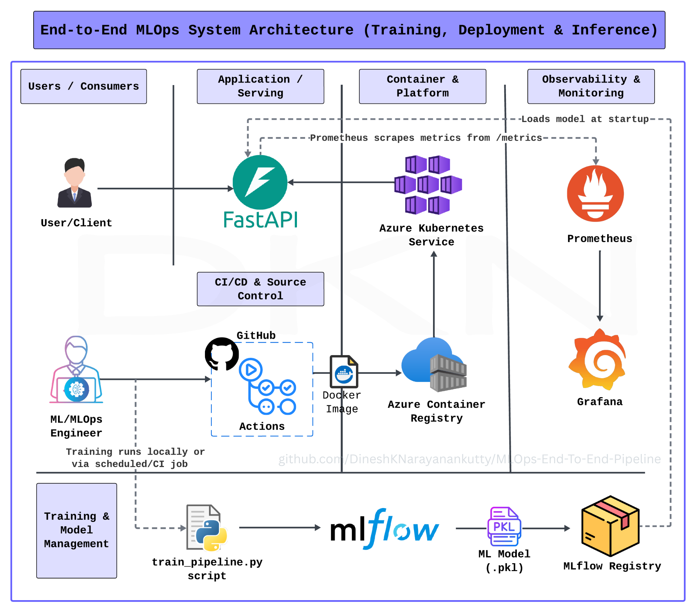

# End-to-End MLOps Pipeline (Iris Classification)

## 📖 Project Overview

This project demonstrates how a **machine learning model is built, packaged, deployed, and operated as a production service**, rather than remaining as a notebook or standalone script.

The **Iris classification problem** is used as a simple, well-known ML task so that the focus remains on **system architecture, deployment, and operations** instead of model complexity.

At a high level, this project covers:

* Training a reproducible ML model
* Tracking experiments and artifacts with MLflow
* Serving predictions through a REST API
* Packaging the application using Docker
* Storing images in Azure Container Registry (ACR)
* Deploying the service to Azure Kubernetes Service (AKS)
* Observing runtime behavior with Prometheus and Grafana

---

## 🎯 Core Intention

The core intention of this project is to show that:

> **A trained ML model only becomes valuable when it can run reliably as a service.**

Rather than focusing on algorithm tuning, this project emphasizes the operational side of ML systems:

| Area       | What This Project Demonstrates      |
| ---------- | ----------------------------------- |
| Training   | Script-driven, repeatable training  |
| Tracking   | Versioned experiments and artifacts |
| Serving    | API-based access to the model       |
| Packaging  | Immutable Docker images             |
| Deployment | Kubernetes-based runtime (AKS)      |
| Operations | Health checks and metrics           |

The model is treated as **software that must be built, deployed, and operated**, not as a one-time experiment.

---

## 🌸 Why the Iris Dataset?

The Iris dataset is intentionally chosen because it is:

* Small and fast to train
* Easy to understand without deep ML knowledge
* Free from complex data engineering requirements

This allows anyone reading the project to focus on **how the system works end to end**. The same architecture can be reused for larger, real-world datasets without changing the overall design.

---

## 🧠 End-to-End Flow

```
Load Data
   ↓
Train Model
   ↓
Log Metrics & Model Artifact (MLflow)
   ↓
Package API with Docker
   ↓
Push Image to Azure Container Registry (ACR)
   ↓
Deploy to Azure Kubernetes Service (AKS)
   ↓
Serve Predictions via REST API
   ↓
Expose Metrics → Prometheus → Grafana
```

External users interact only with the **API**, not with the training or model management components.

---

## 🏗️ High-Level Architecture



## 🖇️ Logical Flow

```
Training Script
   │
   ▼
MLflow (Experiments & Artifacts)
   │
   ▼
FastAPI Application
   │
   ▼
Docker Image
   │
   ▼
Azure Container Registry (ACR)
   │
   ▼
Azure Kubernetes Service (AKS)
   │
   ▼
Prometheus → Grafana
```

---

## 📁 Project Structure Explained

```
MLOps-End-To-End-Pipeline/
│
├── api/                     # FastAPI application (model serving)
│   └── main.py              # API endpoints, health, metrics
│
├── src/                     # Core ML logic
│   ├── data_loader.py       # Dataset loading
│   ├── preprocessing.py     # Feature preprocessing
│   ├── training.py          # Model training logic
│   ├── model_registry.py    # MLflow model registration
│   └── drift_detector.py    # Drift detection logic
│
├── scripts/                 # Pipeline automation
│   ├── train_pipeline.py    # End-to-end training pipeline
│   └── model_promotion.py   # Model promotion logic
│
├── tests/                   # Unit & API tests
│   ├── test_api.py
│   ├── test_data_loader.py
│   ├── test_preprocessing.py
│   └── test_training.py
│
├── k8s/                     # Kubernetes manifests
│   ├── app/                 # API deployment & service
│   └── observability/       # Prometheus, Grafana, MLflow
│
├── .github/workflows/       # GitHub Actions CI/CD pipelines
│   ├── tests.yml            # Run tests
│   ├── build.yml            # Build & push Docker image to ACR
│   ├── deploy.yml           # Deploy to AKS
│   └── observability.yml    # Deploy monitoring stack
│
├── Dockerfile               # Container definition
├── docker-compose.yml       # Local multi-service setup
├── requirements.txt         # Runtime dependencies
├── requirements-dev.txt     # Development & testing dependencies
└── README.md
```

---

## 🔬 Machine Learning Details

| Aspect       | Description                               |
| ------------ | ----------------------------------------- |
| Problem Type | Multiclass classification                 |
| Dataset      | Iris dataset                              |
| Library      | scikit-learn                              |
| Metrics      | Accuracy and basic classification metrics |

The ML implementation is intentionally **simple and modular**, allowing the system architecture to remain the primary focus.

---

## 🔁 Training & Experiment Tracking

Training is executed via a Python script:

```bash
python scripts/train_pipeline.py
```

During training:

* Parameters and metrics are logged to **MLflow**
* The trained model is stored as a **versioned artifact**

This enables reproducibility and comparison across runs.

---

## 🌐 Model Serving (FastAPI)

The FastAPI service exposes:

* `POST /predict` – return model predictions
* `GET /health` – service health status
* `GET /metrics` – Prometheus-compatible metrics

The model is loaded at application startup and used only for inference.

---

## 🐳 Containerization

The FastAPI application is packaged using Docker to ensure consistent behavior across environments.

```bash
docker build -t mlops-api .
```

The image is pushed to **Azure Container Registry (ACR)**:

```bash
docker tag mlops-api <acr-name>.azurecr.io/mlops-api:latest
docker push <acr-name>.azurecr.io/mlops-api:latest
```

---

## ☸️ Kubernetes Deployment (AKS)

The containerized application is deployed to **Azure Kubernetes Service (AKS)**.

Deployment flow:

```
GitHub Actions → Azure Container Registry (ACR) → AKS
```

Kubernetes is responsible for:

* Running application pods
* Restarting failed containers
* Exposing the API through a Kubernetes Service

---

## 📊 Monitoring & Observability

* **Prometheus** scrapes metrics from the `/metrics` endpoint
* **Grafana** visualizes request counts, latency, and service health

This provides visibility into how the system behaves after deployment.

---

## 🔄 CI/CD with GitHub Actions

GitHub Actions automates the delivery pipeline:

1. Run unit and API tests
2. Build the Docker image
3. Push the image to **Azure Container Registry (ACR)**
4. Deploy the updated image to **AKS**

This ensures every deployment uses a tested, versioned container image.

---

## ▶️ Running Locally

```bash
python -m venv venv
source venv/bin/activate  # Linux / Mac
venv\Scripts\activate     # Windows

pip install -r requirements.txt
uvicorn api.main:app --reload
```

---

## 🔮 Future Improvements

* Automated retraining pipelines
* Advanced drift detection
* Canary or blue-green deployments
* Feature store integration
* Model explainability dashboards

---

## 👤 Author

This project was built to demonstrate **practical MLOps system design**, focusing on clarity, correctness, and real-world deployment patterns.

---

⭐ **Key takeaway:** this repository shows how a simple ML model can be transformed into a reliable, observable production service.
